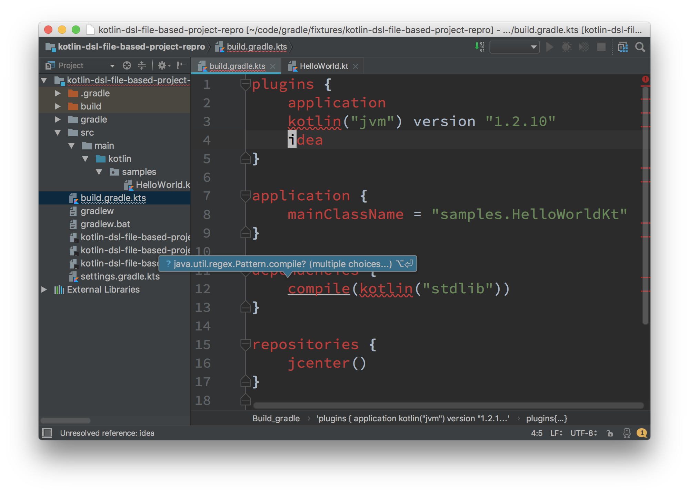
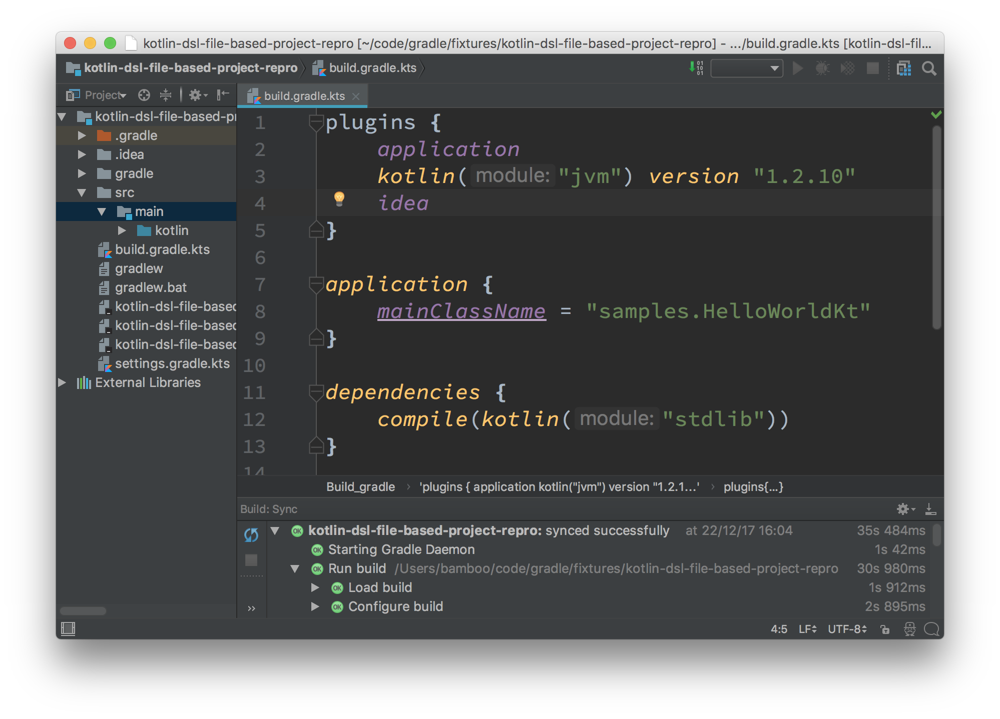

# Gradle Kotlin script from file based project is all red

In order to reproduce the problem

1. run `./gradlew idea`
2. open the generated `ipr` file with IntelliJ IDEA (dot not _Import_ the project but _Open_ the `ipr` instead)
3. open `build.gradle.kts` and notice it's all red
   

Expected behaviour:

